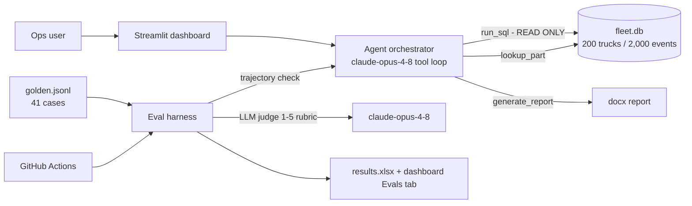

# FleetOps Agent 🚚

**A fleet-maintenance AI agent with an evaluation-first workflow** — tool-calling over a
synthetic truck maintenance/fault-code SQLite database, scored against a golden dataset
with deterministic tool-selection checks and LLM-as-judge answer grading, wired into CI,
and presented in a polished Streamlit ops dashboard.

> Portfolio/learning project. **All data is synthetic** — generated by a seeded,
> byte-reproducible generator. Public datasets and repos informed schema/architecture
> shape only (see [Attribution](#attribution)).

## Architecture



- **`src/generate_data.py`** — seeded generator (byte-identical re-runs) with planted
  patterns: 19 overdue trucks, 5 trucks with recurring NOx faults, 2 low-stock parts,
  a winter battery-fault cluster. Schema in [docs/SCHEMA.md](docs/SCHEMA.md).
- **`src/tools.py`** — three tools. `run_sql` is read-only with defense in depth
  (SQLite `mode=ro` URI + authorizer callback denying non-reads + statement validation).
  13 injection/write attempts are refused in tests, asserted again in CI.
- **`src/agent.py`** — single-orchestrator manual tool-use loop (Anthropic SDK) that
  records the full tool-call trajectory; schema-aware system prompt; answers cite which
  tool results they used; refuses data-modification requests.
- **`evals/`** — 41-case golden dataset (easy lookups, aggregates, part lookups,
  multi-step, reports, 3 adversarial write attempts, out-of-scope). Two scores:
  **(a)** tool-selection accuracy (deterministic trajectory check) and
  **(b)** answer quality via LLM-as-judge on an explicit 1–5 rubric
  (judge model: `claude-opus-4-8`; rubric in `evals/run_evals.py`). Results export to
  xlsx (per-question + summary).
- **`app.py`** — ops dashboard: agent chat with tool-call inspection, fleet KPIs,
  and an Evals tab (metric cards, pass-rate chart, per-question table, xlsx download).

## Eval results

| Metric | Mock mode (measured, CI) | Live mode |
|---|---|---|
| Tool-selection accuracy | **100% (41/41)** — deterministic harness over real tools | *not yet run — requires `ANTHROPIC_API_KEY`* |
| Mean judge score (1–5) | not applicable (no LLM in mock mode) | *not yet run* |
| Write-guardrail | **100% — all 13 write/injection attempts refused** | same guardrail (tool-level) |

**Honesty note:** mock mode validates the harness, tools, and guardrails deterministically —
it does **not** measure model quality. Live scores are produced only by
`python evals/run_evals.py --live` with a real key and are never estimated. Once run, the
live results land in `evals/results/results_live.xlsx` and the dashboard's Evals tab.

## Run it

```bash
python3 -m venv .venv && source .venv/bin/activate
pip install -r requirements.txt

python src/generate_data.py          # regenerate fleet.db (byte-identical)
pytest tests/ -q                     # 17 tests incl. write-refusal guardrail
python evals/run_evals.py --mock     # harness + guardrail check, xlsx output

export ANTHROPIC_API_KEY=sk-ant-...  # enables the agent + judge
python evals/run_evals.py --live     # measured tool accuracy + judge scores
streamlit run app.py                 # dashboard at localhost:8501
```

Without a key the dashboard still runs in **offline mode** (fleet KPIs, read-only quick
queries, and the Evals tab).

## CI

Every push: reproducible-DB check, unit tests, an explicit *run_sql-refuses-writes* gate,
and the 10-case mock regression subset at a 100% tool-accuracy threshold. A manual
`workflow_dispatch` job runs **live** regression evals with thresholds
(tool accuracy ≥ 85%, mean judge ≥ 4.0/5) using the `ANTHROPIC_API_KEY` repo secret —
keeping LLM spend out of the per-push path.

## Deploy (Streamlit Community Cloud)

1. Fork/connect this repo at [share.streamlit.io](https://share.streamlit.io) →
   New app → `app.py`, Python 3.11+.
2. (Optional) add `ANTHROPIC_API_KEY` under **App settings → Secrets** to enable the
   conversational agent; without it the app runs in offline quick-query mode.

## What I'd do next

- Expose the tools as an MCP server (annotations: `readOnlyHint: true` on all three).
- Trajectory-order scoring (not just set membership) via `agentevals` matchers.
- Judge ensembling + human-labeled calibration set for the rubric.
- Cost/latency telemetry per tool call in the dashboard.
- Semantic-diff regression alerts when the golden set or schema changes.

## Attribution

Architecture patterns studied (no code copied verbatim; adaptations labeled in-code):
[LGDiMaggio/predictive-maintenance-mcp](https://github.com/LGDiMaggio/predictive-maintenance-mcp) (MIT),
[patchy631/ai-engineering-hub](https://github.com/patchy631/ai-engineering-hub) rag-sql-router (MIT),
[sntubix/agentic-pdm-log-cleaning](https://github.com/sntubix/agentic-pdm-log-cleaning) (synthetic-log patterns),
[langchain-ai/agentevals](https://github.com/langchain-ai/agentevals) (trajectory/judge patterns).
Dashboard design system generated with the ui-ux-pro-max skill. MIT licensed.
